# Frontend i18n with locale routing Implementation Plan

> **For agentic workers:** REQUIRED SUB-SKILL: Use
> sdlc:subagent-driven-development (recommended) or sdlc:executing-plans to
> implement this plan task-by-task. Steps use checkbox (`- [ ]`) syntax for
> tracking.

**Goal:** Add full i18n support with `vi` default and `/en` locale routing, translating all frontend UI copy and fixing missing i18n modules.

**Architecture:** Use `next-intl` with locale prefix `as-needed` and App Router segment `app/[locale]` for locale-aware pages. Centralize messages in `src/messages`, provide a shared `I18nProvider` and navigation helpers, and update middleware to preserve locale during auth redirects.

**Tech Stack:** Next.js App Router, TypeScript, `next-intl`, Tailwind CSS.

---

> **Spec:** `.sdlc/SPEC014-frontend-i18n-next-intl/spec.md`
> **Status:** Draft
> **Author:** OpenCode
> **Date:** 2026-05-02

---

## 1. Architecture Overview

### 1.1 System Context
Frontend-only change. Locale resolution and message loading happen on the server via `next-intl` request config. Client components use a shared `useT()` hook for message access.

### 1.2 Component Interaction

```
Request → middleware (next-intl + auth) → app/[locale]/layout → I18nProvider → client hooks/components
```

---

## 2. Tech Stack & Dependencies

| Category | Choice | Version | Rationale |
|----------|--------|---------|-----------|
| Framework | Next.js App Router | 16.x | Existing frontend stack |
| Library | next-intl | latest | Locale routing + messages |
| Styling | Tailwind CSS | 4.x | Existing styles |

### 2.1 New Dependencies

- `next-intl`: Provide locale routing, message loading, and translation hooks.

### 2.2 Existing Modules Used (read-only)

- `frontend/src/app/**`: Page components to migrate into `app/[locale]`.
- `frontend/src/components/**`: UI copy to translate.
- `frontend/src/middleware.ts`: Auth middleware to wrap with locale logic.

---

## 3. Data Model

No database changes.

---

## 4. API Contracts

No backend API changes. Routes are locale-prefixed on the frontend only.

---

## 5. Internal Service Design

### 5.1 i18n Module Layout

```
src/i18n/routing.ts        → locales + localePrefix
src/i18n/request.ts        → getRequestConfig + messages loader
src/i18n/navigation.ts     → locale-aware Link + router helpers
src/shared/i18n.tsx        → I18nProvider + useT hook
src/messages/vi.json       → Vietnamese messages
src/messages/en.json       → English messages
```

---

## 6. Error Handling

| Error Code | Scenario | Response |
|------------|----------|----------|
| I18N_MESSAGES_MISSING | Locale messages missing | Throw in dev to fail fast. |
| I18N_KEY_MISSING | Key missing | Fallback to default locale, log in dev. |

---

## 7. Test Strategy

> **TDD Required:** Every task step must follow RED-GREEN-REFACTOR cycle.
> Read `test-driven-development` skill before writing implementation code.

### 7.1 RED-GREEN-REFACTOR per Task

Each implementation task MUST follow this sequence:

```dot
digraph task_tdd_flow {
    rankdir=LR;
    red [label="RED\nWrite failing test first", shape=box, style=filled, fillcolor="#ffcccc"];
    run_red [label="npm test\nVerify it FAILS", shape=diamond];
    green [label="GREEN\nWrite minimal code", shape=box, style=filled, fillcolor="#ccffcc"];
    run_green [label="npm test\nVerify it PASSES", shape=diamond];
    refactor [label="REFACTOR\n(if needed)", shape=box, style=filled, fillcolor="#ccccff"];

    red -> run_red;
    run_red -> green [label="fails correctly"];
    run_red -> red [label="wrong failure"];
    green -> run_green;
    run_green -> refactor [label="passes"];
    run_green -> green [label="still fails"];
}
```



### 7.2 Task List

- [ ] **Task 1:** Install `next-intl` dependency
- [ ] **Task 2:** Set up i18n routing config (`routing.ts`, `request.ts`)
- [ ] **Task 3:** Create message files (`vi.json`, `en.json`) with initial keys
- [ ] **Task 4:** Move app routes to `app/[locale]` segment (locale-aware)
- [ ] **Task 5:** Create `I18nProvider` + `useT` hook in `src/shared/i18n.tsx`
- [ ] **Task 6:** Update middleware for locale preservation during auth redirects
- [ ] **Task 7:** Add locale switcher UI to Navbar
- [ ] **Task 8:** Translate all remaining UI copy to message files
- [ ] **Task 9:** Run smoke tests and verify locale routing works

---

### 7.2 Task Step Format

Every task step must include TDD sub-steps:

```markdown
### Task N: {Task Name}

**Description:** What this builds

**Files:** `src/features/<name>/utils/<name>.ts`, `src/features/<name>/utils/<name>.test.ts`

---

**[RED]** Write failing test:

```typescript
// src/features/<name>/utils/<name>.test.ts
test('TC-XX: {Test Name}', () => {
  // Given: setup
  // When: action
  // Then: assertion
});
```

**[RED]** Run: `npm test src/features/<name>/utils/<name>.test.ts`
**Expected:** FAIL — "Cannot find module" or expected error

**[GREEN]** Write minimal implementation:

```typescript
// src/features/<name>/utils/<name>.ts
export function myFunction(input: string): string {
  return input;
}
```

**[GREEN]** Run: `npm test src/features/<name>/utils/<name>.test.ts`
**Expected:** PASS

**[REFACTOR]** (optional) Clean up if needed, keep tests green.
```

### 7.3 Anti-Patterns Warning

**Read before writing mocks:** `@testing-anti-patterns.md`

Common violations:

| Violation | Why Wrong | Prevention |
|-----------|-----------|------------|
| Test mock behavior instead of real behavior | Test proves nothing | Don't assert on mock internals |
| Partial mock (missing fields) | Silent integration failures | Mirror real API completely |
| Test-only methods in production | Pollutes production code | Move to test utilities |

### 7.4 Coverage Target

| Layer | What to Test | Minimum Coverage |
|-------|-------------|-----------------|
| Utils/Hooks | Business logic | 80% |
| API functions | Transform/export logic | 70% |
| Forms/Validation | Input validation | 90% |

---

## 8. Constraints & Trade-offs

### 8.1 Constraints
- Must follow `.sdlc/AGENTS.md` conventions.
- Use locale prefix `as-needed`.
- All UI copy must be moved into message files.

### 8.2 Trade-offs
| Decision | Alternative | Why this choice |
|----------|-------------|-----------------|
| next-intl | custom context | Standard locale routing + App Router support |
| app/[locale] segment | rewrite-only | Reliable locale propagation in App Router |

### 8.3 Out of Scope (Technical)
- Backend localization.
- Additional locales beyond `vi` and `en`.

---

## 9. Change Log

| Date | Version | Changed By | Change Summary | Reason | Affected Sections |
|------|---------|------------|----------------|--------|-------------------|
| 2026-05-02 | v1.0 | OpenCode | Initial plan | Spec approved | All |

### Follow-ups

<!-- Track items discovered during implementation that were NOT in original plan -->

| Date | Item | Impact | Status |
|------|------|--------|--------|
| | | | Pending |

### Change Rules

1. Every change logged with version bump
2. Follow-ups section captures implementation discoveries
3. When follow-ups require code changes → implement directly
