# Feature: Frontend i18n with locale routing

> **Status:** Draft
> **Author:** OpenCode
> **Date:** 2026-05-02
> **Related Issues:** N/A

---

## 1. Problem Statement

### 1.1 User Problem

The frontend currently imports missing i18n modules, causing runtime build errors and blocking the app from loading. There is no consistent, locale-aware experience for Vietnamese or English users.

### 1.2 Business Impact

The app fails to start reliably and cannot serve multiple languages. This limits onboarding for English users and prevents SEO-friendly locale URLs.

### 1.3 Success Criteria

- [ ] App boots without i18n module errors and renders all routes.
- [ ] Locale routing works: `/` serves Vietnamese, `/en/*` serves English.
- [ ] All visible UI strings are loaded from translation messages.
- [ ] Locale-aware redirects preserve the requested locale.

---

## 2. User Stories & Acceptance Criteria

### Story 1: Default Vietnamese experience

**As a** Vietnamese user,
**I want** the default URL `/` to show Vietnamese UI,
**so that** I can use the app without extra configuration.

#### Acceptance Criteria

- **Given** I visit `/login` without a locale prefix,
  **When** the page loads,
  **Then** the UI renders in Vietnamese without redirect.

- **Given** I navigate within `/`,
  **When** I click navigation links,
  **Then** the locale remains Vietnamese.

### Story 2: English locale prefix

**As a** English-speaking user,
**I want** to access `/en` URLs,
**so that** I can read the UI in English.

#### Acceptance Criteria

- **Given** I visit `/en/studio`,
  **When** the page loads,
  **Then** the UI renders in English.

- **Given** I am on `/en` routes,
  **When** I navigate between pages,
  **Then** the `/en` prefix is preserved.

### Story 3: Language switcher

**As a** user,
**I want** to switch between Vietnamese and English,
**so that** I can use my preferred language.

#### Acceptance Criteria

- **Given** I am on `/studio`,
  **When** I switch to English,
  **Then** I land on `/en/studio` (or `/en` fallback if missing).

---

## 3. Functional Requirements

### 3.1 Core Behaviors

| ID | Requirement | Priority |
|----|-------------|----------|
| FR-1 | Support locales `vi` (default) and `en` (fallback). | Must |
| FR-2 | Use locale prefix strategy `as-needed`: `vi` uses `/`, `en` uses `/en`. | Must |
| FR-3 | All user-facing copy is read from locale message files. | Must |
| FR-4 | Locale-aware navigation keeps the active locale during link navigation. | Must |
| FR-5 | Auth middleware preserves locale in redirects (login/dashboard). | Must |
| FR-6 | Metadata (title, description, open graph) is localized. | Should |
| FR-7 | A UI toggle allows switching between `vi` and `en`. | Should |
| FR-8 | Missing keys fall back to default locale or surface during development. | Should |

### 3.2 Edge Cases

- Invalid locale prefix returns 404 or redirects to default locale.
- Locale switcher targets a route missing in the other locale and falls back to home.
- Static assets and API routes bypass locale middleware.

### 3.3 Error Handling

| Scenario | Expected Behavior |
|----------|-------------------|
| Missing locale messages file | Fail fast in development with a clear error. |
| Missing translation key | Use default locale fallback; in dev, show missing key warnings. |

---

## 4. Non-Functional Requirements

### 4.1 Performance

- Locale resolution must not add noticeable latency for navigation.

### 4.2 Security

- Locale handling must not bypass existing auth checks.

### 4.3 Constraints

- Platform: Next.js App Router.
- Dependency: `next-intl` for i18n infrastructure.
- Must coexist with existing auth middleware and public routes.

---

## 5. Unit Test Cases (TDD)

> **TDD Required:** Every test case below must be implemented using RED-GREEN-REFACTOR cycle.
> Read `test-driven-development` skill before writing any implementation code.

### 5.1 The Iron Law

```
NO PRODUCTION CODE WITHOUT A FAILING TEST FIRST
```

Write code before the test? **Delete it. Start over.**

### 5.2 RED-GREEN-REFACTOR per Test Case

For each test case (TC-XX), you MUST follow this exact sequence:

```dot
digraph test_case_flow {
    rankdir=LR;
    red [label="RED\nWrite failing test first", shape=box, style=filled, fillcolor="#ffcccc"];
    run_red [label="Run test\nVerify it FAILS", shape=diamond];
    green [label="GREEN\nWrite minimal code", shape=box, style=filled, fillcolor="#ccffcc"];
    run_green [label="Run test\nVerify it PASSES", shape=diamond];
    refactor [label="REFACTOR\n(if needed)", shape=box, style=filled, fillcolor="#ccccff"];

    red -> run_red;
    run_red -> green [label="fails correctly"];
    run_red -> red [label="wrong failure"];
    green -> run_green;
    run_green -> refactor [label="passes"];
    run_green -> green [label="still fails"];
}
```



### 5.3 Test Case Registry

| ID | File | Description | Status |
|----|------|-------------|--------|
| TC-01 | src/i18n/routing.test.ts | Locale prefix rules and default locale resolution. | RED |
| TC-02 | src/i18n/request.test.ts | Message loading for `vi` and `en`, including fallback. | RED |
| TC-03 | src/middleware.test.ts | Locale preserved in auth redirects. | RED |

### 5.4 Test Case Template

```markdown
#### TC-XX: {Test Name}

**Given** (setup):
> Description of initial state

**When** (action):
> The action being tested

**Then** (assertion):
> Expected outcome

---

**[RED]** Write the failing test:

```typescript
// src/features/<name>/utils/<name>.test.ts
test('TC-XX: {Test Name}', () => {
  // Given: setup
  // When: action
  // Then: assertion
});
```

**[RED]** Run test, verify it fails with expected error.

**[GREEN]** Write minimal implementation.

**[GREEN]** Run test, verify it passes.

**[REFACTOR]** (optional) Clean up if needed, keep tests green.
```

### 5.5 Anti-Patterns Warning

**Read before writing mocks:** `@testing-anti-patterns.md`

### 5.6 TDD Verification Checklist

- [ ] **RED:** Test written first, before any implementation code
- [ ] **RED:** Ran test, confirmed it FAILS with expected error
- [ ] **RED:** Failure is because feature is missing (not typo in test)
- [ ] **GREEN:** Wrote minimal code to pass the test
- [ ] **GREEN:** Ran test, confirmed it PASSES
- [ ] **GREEN:** No other existing tests broke
- [ ] **REFACTOR:** Cleaned up if needed, tests stayed green
- [ ] **Anti-pattern check:** No testing mock behavior, no partial mocks

---

## 6. Boundaries

### [ALLOW] Always Do

- Keep locale prefix in links and redirects.
- Keep user-facing copy in translation files only.

### [CAUTION] Ask First

- Adding or removing supported locales.
- Changing locale prefix strategy.

### [FORBID] Never Do

- Commit secrets or API keys.
- Write production code before writing test first.

---

## 7. Verification

### 7.1 Test Plan

| Requirement | Test Method | TDD Status |
|-------------|-------------|------------|
| FR-1 | Unit tests for locale resolution + manual smoke test | Pending (RED) |
| FR-2 | Unit tests for routing + manual navigation checks | Pending (RED) |
| FR-3 | Manual audit of UI strings + grep for hard-coded copy | Pending |
| FR-5 | Manual auth redirect checks for `/` and `/en` | Pending |

### 7.2 Acceptance Checklist

- [ ] All user stories implemented
- [ ] All acceptance criteria met
- [ ] Edge cases handled
- [ ] Error responses match spec
- [ ] Performance targets achieved
- [ ] All TDD test cases follow RED-GREEN-REFACTOR cycle
- [ ] Each test verified RED before GREEN
- [ ] Tests pass with required coverage
- [ ] No boundary violations

---

## 8. Out of Scope

- Additional locales beyond `vi` and `en`.
- Backend localization or API response translation.
- Content rewriting or UX redesign unrelated to translation.

---

## 9. Change Log

| Date | Version | Changed By | Change Summary | Reason | Affected Sections |
|------|---------|------------|----------------|--------|-------------------|
| 2026-05-02 | v1.0 | OpenCode | Initial spec | New i18n requirement | All |
