# Hướng Dẫn Huấn Luyện Mô Hình TTS — Pipeline Hoàn Chỉnh

Quy trình chuẩn A-Z để xây dựng mô hình Text-to-Speech tiếng Việt. Dữ liệu huấn luyện được tạo từ **audio thật** (Postcard, audiobook, podcast...) và huấn luyện bằng **Piper TTS**.

**Thư mục làm việc chính:** `C:\Qwen_TTS_local\` (WSL/Linux)

---

## Mục Lục

1. [Tổng Quan & Kiến Trúc Pipeline](#1-tổng-quan--kiến-trúc-pipeline)
2. [Yêu Cầu Trước Khi Bắt Đầu](#2-yêu-cầu-trước-khi-bắt-đầu)
3. [Giai Đoạn 0: Chuẩn Bị Dataset (Từ Audio Thật)](#giai-đoạn-0--chuẩn-bị-dataset-từ-audio-thật)
4. [Giai Đoạn 1: Chuẩn Bị Dữ Liệu cho Piper](#giai-đoạn-1--chuẩn-bị-dữ-liệu-cho-piper)
5. [Giai Đoạn 2: Tiền Xử Lý cho Piper](#giai-đoạn-2--tiền-xử-lý-cho-piper)
6. [Giai Đoạn 3: Huấn Luyện Piper](#giai-đoạn-3--huấn-luyện-piper)
7. [Giai Đoạn 4: Xuất ONNX](#giai-đoạn-4--xuất-onnx)
8. [Giai Đoạn 5: Kiểm Tra Phát Âm](#giai-đoạn-5--kiểm-tra-phát-âm)
9. [Tham Chiếu Nhanh](#tham-chiếu-nhanh)
10. [Xử Lý Sự Cố](#xử-lý-sự-cố)

---

## 1. Tổng Quan & Kiến Trúc Pipeline

### 1.1 Hai Phương Pháp Huấn Luyện Piper

| Phương pháp | Khi nào dùng | Dữ liệu cần | Thời gian huấn luyện |
|---|---|---|---|
| **Fine-tune** (khuyến nghị) | Tạo giọng nói tùy chỉnh từ mô hình có sẵn | ~1.300 câu | ~1.000 epoch (vài ngày trên GPU phổ thông) |
| **Huấn luyện từ đầu** | Không có checkpoint tương thích | 13.000+ câu | ~2.000 epoch (nhiều tuần) |

> **Khuyến nghị**: Fine-tune từ checkpoint có sẵn là phương pháp được ưu tiên cho tiếng Việt. Yêu cầu dữ liệu ít hơn ~10 lần và giảm đáng kể thời gian huấn luyện.

### 1.2 Pipeline Hoàn Chỉnh (Từ Audio Thật)

Pipeline này dùng cho audio thật (Postcard, audiobook, podcast từ internet). Nếu dùng Qwen3-TTS để sinh audio, xem [Giai Đoạn 0 Alt: Tạo Dataset bằng Qwen3-TTS](#giai-đoạn-0-alt--tạo-dataset-bằng-qwen3-tts).

```mermaid
flowchart TD
    subgraph Phase0["Giai Đoạn 0: Chuẩn Bị Dataset"]
        A1["📁 Audio gốc\nMP3 / M4A / Audiobook\n(từ internet)"]
        A2["Step 1: Convert\nMP3/M4A → WAV\n(01_wav_raw/)"]
        A3["Step 2: Extract Vocal\nDemucs lọc nhạc nền\nchỉ giữ VOCAL\n(02_wav_vocal/)"]
        A4["Step 3: Slice & Process\n-3dB gain reduction\nResample 22050Hz\nCắt chunks 2-10s\nNormalize -20dBFS\n(03_wav_chunks/)"]
        A5["Step 4: Transcribe\nWhisper LARGE-V2\n→ metadata_raw.csv\n(metadata/)"]
        A6["✏️  Chỉnh sửa chính tả\nthủ công\n→ metadata_final.csv"]
        A1 --> A2 --> A3 --> A4 --> A5 --> A6
    end

    subgraph Phase1["Giai Đoạn 1: Chuẩn Bị LJSpeech"]
        B1["Chuẩn LJSpeech\n(config + dataset.jsonl)"]
        A6 --> B1
    end

    subgraph Phase2["Giai Đoạn 2: Tiền Xử Lý"]
        C1["piper_train.preprocess\n(config.json + dataset.jsonl)"]
        B1 --> C1
    end

    subgraph Phase3["Giai Đoạn 3: Huấn Luyện"]
        D1["Fine-tune từ checkpoint\n(en_US/lessac/medium)"]
        D2["Checkpoint .ckpt\n/epoch=N-step=M.ckpt"]
        C1 --> D1 --> D2
    end

    subgraph Phase4["Giai Đoạn 4: Xuất ONNX"]
        E1["piper_train.export_onnx\n(Piper 2.0.1 CPU env)"]
        E2["Tệp .onnx + .onnx.json\n(baouyen_NNNN.onnx)"]
        E3["Upload lên R2\nCloudflare"]
        D2 --> E1 --> E2 --> E3
    end

    subgraph Browser["Browser App (app-gen-voice-ai)"]
        F1["Tải .onnx từ R2"]
        F2["ONNX Runtime Web\n(WASM)"]
        F3["Phát audio\ntrong trình duyệt"]
        E3 --> F1 --> F2 --> F3
    end

    style A1 fill:#1a1a2e,color:#fff
    style A2 fill:#16213e,color:#fff
    style A3 fill:#0f3460,color:#fff
    style A4 fill:#533483,color:#fff
    style A5 fill:#e94560,color:#fff
    style A6 fill:#f39c12,color:#fff
```



**Nguyên tắc thứ tự quan trọng:**

```
THỨ TỰ ĐÚNG:
  1. Convert → 2. Vocal Extract → 3. Slice & Process → 4. Transcribe

SAI (không làm):
  1. Slice → 2. Vocal Extract → 3. ... (sai vì cắt TRƯỚC khi lọc nhạc)
```

### 1.3 Cấu Trúc Thư Mục `C:\Qwen_TTS_local\`

```
C:\Qwen_TTS_local\                    # ← Thư mục chính (WSL/Linux)
│
├── pipeline\                         # ← PIPELINE MỚI (chuẩn)
│   ├── config_pipeline.py            #   ⚙️  Cấu hình chung - CHỈ SỬA FILE NÀY!
│   ├── run_pipeline.py               #   🚀 Chạy toàn bộ pipeline
│   ├── step_01_convert.py            #   💾 Step 1: MP3/M4A → WAV
│   ├── step_02_extract_vocal.py      #   🎤 Step 2: Lọc nhạc nền (Demucs)
│   ├── step_03_slice_process.py      #   ✂️ Step 3: -3dB, Resample, Cắt, Normalize
│   └── step_04_transcribe.py         #   🎙️ Step 4: Whisper → metadata.csv
│
├── datasets\                         # Dataset đã tạo / đã xử lý
│   └── {project_name}\              #   Mỗi voice/tập dữ liệu một thư mục con
│       ├── raw\                      #       Audio gốc (MP3/M4A/audiobook)
│       ├── 01_wav_raw\              #       WAV sau khi convert
│       ├── 02_wav_vocal\            #       WAV vocal đã lọc nhạc nền
│       ├── 03_wav_chunks\           #       Các chunk đã cắt & chuẩn hóa
│       └── metadata\                #       metadata_raw.csv + metadata_final.csv
│
│   ├── dataset_qwen\                 #   Voice Design output (Qwen3-TTS)
│   ├── dataset_clone\                #   Voice Cloning output (Qwen3-TTS)
│   └── dataset_edge\                 #   Edge-TTS output
│
├── piper\                            # Piper TTS (fork từ rhasspy/piper)
│   ├── src\python\piper_train\      #   Code huấn luyện VITS
│   │   ├── vits\                    #   Models, lightning, mel processing
│   │   ├── monotonic_align\          #   C extension đã build
│   │   └── preprocess.py             #   Tiền xử lý dataset
│   └── wavs\                         #   Audio gốc (thu âm)
│
├── piper_dataset\                    # Dataset cho huấn luyện Piper (legacy)
│   ├── wavs\                        #   Audio chưa xử lý
│   ├── wavs_clean\                   #   Audio đã lọc nhạc nền
│   ├── metadata.csv                 #   Transcription đã duyệt
│   └── dataset.jsonl                 #   Dataset huấn luyện (sau preprocess)
│
├── piper_train\                      # Sao chép của piper/src/python/piper_train
│   ├── vits\                        #   Models + lightning wrapper
│   ├── monotonic_align\              #   C extension
│   └── ...
│
├── training_dir\                     # Thư mục huấn luyện chính
│   ├── config.json                   #   Config (phoneme_id_map, audio settings)
│   ├── dataset.jsonl                 #   Dataset sau tiền xử lý
│   ├── lightning_logs\               #   Checkpoint từ PyTorch Lightning
│   └── cache\                        #   Cache mel spectrogram
│
├── utils\                            # Script tiện ích (legacy)
│   ├── slice_audio.py               #   ⚠️  CŨ - thay bằng pipeline/
│   ├── auto_transcribe.py           #   ⚠️  CŨ - thay bằng pipeline/step_04
│   ├── loc_nhac.py                   #   ⚠️  CŨ - thay bằng pipeline/step_02
│   └── ...
│
├── batchs\                           # Script tạo audio hàng loạt (Qwen3-TTS)
│   ├── batch_gen_Voice_Design.py     #   Voice Design (Qwen3-TTS)
│   └── batch_gen_Voice_Cloning.py    #   Voice Cloning (Qwen3-TTS)
│
├── baouyen_*.onnx                    # Các checkpoint đã export (NNNn = số epoch)
├── baouyen_*.onnx.json               # Config đi kèm mỗi ONNX
├── model.safetensors                 # Base model Qwen3-TTS
├── export_onnx.py                    # Script xuất ONNX từ .ckpt
└── test_giong.py                    # Script test giọng
```

> **Mẹo**: Trên Windows, truy cập qua `C:\Qwen_TTS_local` hoặc dùng WSL path `/mnt/c/Qwen_TTS_local/`.
> **Quan trọng**: Script trong `pipeline/` thay thế các script cũ trong `utils/` và thư mục gốc.

---

## 2. Yêu Cầu Trước Khi Bắt Đầu

| Yêu cầu | Phiên bản / Chi tiết | Ghi chú |
|---|---|---|
| Hệ điều hành | Windows + WSL2 (Ubuntu 22.04) | Hoặc Linux thuần |
| GPU | NVIDIA có CUDA | Driver CUDA 12.4 tương thích |
| VRAM | 8GB+ cho pipeline, 12GB+ cho huấn luyện Piper | Whisper LARGE-V2 cần ~10GB VRAM |
| Python | 3.10+ | Dùng virtualenv riêng |
| Dung lượng ổ cứng | 100GB+ trống | Cho dataset, model, checkpoint |
| RAM | 16GB+ | |

### Thư Viện Hệ Thống (WSL/Linux)

```bash
sudo apt-get update
sudo apt-get install -y python3-dev espeak-ng ffmpeg

# Demucs cho tách nhạc nền
pip install demucs

# Whisper cho transcription
pip install openai-whisper
```

### Các Môi Trường Python (venv)

| Môi trường | Mục đích | Lệnh tạo |
|---|---|---|
| `venv_win` | Huấn luyện Piper (GPU) | `python -m venv venv_win` |
| `venv_linux` | Huấn luyện Piper (WSL/Linux) | `python3 -m venv venv_linux` |
| `.venv` | Môi trường chính (Qwen3-TTS + pipeline) | Đã có sẵn |

---

## Giai Đoạn 0: Chuẩn Bị Dataset (Từ Audio Thật)

Đây là pipeline chuẩn khi dùng **audio thật** (Postcard, audiobook, podcast từ internet).

### 3.1 Cấu Hình Pipeline

**⚠️  BƯỚC QUAN TRỌNG NHẤT — Trước khi chạy pipeline**

Mở file `pipeline/config_pipeline.py` và sửa phần đường dẫn:

```python
# ====== 1. ĐƯỜNG DẪN ======
# Đặt file MP3/M4A/audiobook CỦA BẠN vào đây!
INPUT_DIR = "datasets/nguoivietuoi/raw"

# Các thư mục output sẽ tự tạo:
WAV_RAW_DIR = "datasets/nguoivietuoi/01_wav_raw"
WAV_VOCAL_DIR = "datasets/nguoivietuoi/02_wav_vocal"
WAV_CHUNKS_DIR = "datasets/nguoivietuoi/03_wav_chunks"
METADATA_DIR = "datasets/nguoivietuoi/metadata"
```

### 3.2 Chạy Pipeline Tự Động

```bash
cd C:\Qwen_TTS_local
source .venv/Scripts/activate    # Windows: .venv\Scripts\activate
                                   # WSL/Linux: source .venv/bin/activate

python pipeline/run_pipeline.py    # Chạy toàn bộ pipeline (Step 1→4)
```

### 3.3 Chạy Từng Bước Riêng Biệt

Nếu muốn kiểm soát từng bước:

```bash
# Step 1: Convert MP3/M4A → WAV
python pipeline/step_01_convert.py

# Step 2: Lọc nhạc nền bằng Demucs (giữ Vocal)
# ⚠️  Cần cài: pip install demucs
python pipeline/step_02_extract_vocal.py

# Step 3: -3dB, Resample, Cắt chunks, Normalize
python pipeline/step_03_slice_process.py

# Step 4: Whisper transcribe → metadata.csv
# ⚠️  Cần GPU ~10GB VRAM (nếu hết, đổi WHISPER_MODEL = "medium")
python pipeline/step_04_transcribe.py
```

### 3.4 Chi Tiết Từng Bước

#### Step 1: Convert (MP3/M4A → WAV)

Hỗ trợ: MP3, M4A, AAC, FLAC, OGG, WMA, Opus, WAV.

Input: `datasets/xxx/raw/*.mp3` → Output: `datasets/xxx/01_wav_raw/*.wav`

Không làm gì khác ngoài chuyển đổi format. Sample rate và channels giữ nguyên từ file gốc.

#### Step 2: Extract Vocal (Demucs)

Dùng **Demucs** để tách vocal khỏi nhạc nền.

Input: `datasets/xxx/01_wav_raw/*.wav` → Output: `datasets/xxx/02_wav_vocal/*.wav`

**Cấu hình trong `config_pipeline.py`:**

```python
DEMUCS_MODEL = "htdemucs"   # Tốt nhất, cần VRAM 8GB+
                             # Hoặc "mdx_extra" (chậm hơn, chất lượng cao hơn)
                             # Hoặc "mdx" (nhanh, chất lượng thấp hơn)
DEMUCS_STEM = "vocals"       # Luôn luôn tách vocals
```

> **Tại sao bước này phải làm TRƯỚC khi cắt?**
> Nếu cắt trước rồi mới lọc nhạc: mỗi chunk sẽ có nhạc nền cắt không đều, chất lượng vocal giảm. Lọc nhạc TRƯỚC trên file dài → đảm bảo toàn bộ audio được xử lý đồng nhất.

#### Step 3: Slice & Process (-3dB, Resample, Cut, Normalize)

Thực hiện 4 thao tác theo đúng thứ tự:

| Bước | Thao tác | Giá trị mặc định | Ý nghĩa |
|------|----------|-------------------|---------|
| 1 | Hạ âm lượng | `-3dB` | Giảm nhạc nền còn lại sau Demucs |
| 2 | Resample | `22050 Hz` | Chuẩn cho TTS, giảm dung lượng |
| 3 | Cắt chunks | `2-10 giây` | Theo khoảng lặng tự nhiên |
| 4 | Normalize | `-20 dBFS` | Đặt âm lượng đồng đều |

Input: `datasets/xxx/02_wav_vocal/*.wav` → Output: `datasets/xxx/03_wav_chunks/chunk_00000.wav`

**Cấu hình trong `config_pipeline.py`:**

```python
TARGET_SAMPLE_RATE = 22050       # Hz - chuẩn TTS
GAIN_REDUCTION_DB = -3.0         # dB - giảm volume nhạc nền
NORMALIZE_DBFS = -20.0           # dBFS - mức peak chuẩn
MIN_CHUNK_MS = 2000              # ms - chunk tối thiểu 2s
MAX_CHUNK_MS = 10000             # ms - chunk tối đa 10s
MIN_SILENCE_MS = 400             # ms - ngưỡng lặng để cắt
KEEP_SILENCE_MS = 200            # ms - giữ lặng ở đầu/cuối chunk
```

> **Tại sao Normalize ở BƯỚC CUỐI CÙNG?**
> Nếu normalize trước khi cắt: chunk quá ngắn sẽ bị kéo âm lượng bất thường. Normalize SAU khi cắt → mỗi chunk có âm lượng riêng đều nhau.

#### Step 4: Transcribe (Whisper)

Dùng **Whisper LARGE-V2** để chuyển audio thành text → tạo `metadata_raw.csv`.

Input: `datasets/xxx/03_wav_chunks/*.wav` → Output: `datasets/xxx/metadata/metadata_raw.csv`

**Cấu hình trong `config_pipeline.py`:**

```python
WHISPER_MODEL = "large-v2"   # Chính xác nhất, cần ~10GB VRAM
                              # Nếu hết VRAM: đổi thành "medium" (~5GB)
WHISPER_LANGUAGE = "vi"       # Tiếng Việt
```

**Output CSV format:**

```
chunk_00000.wav|Chào bạn, hôm nay trời đẹp quá.
chunk_00001.wav|Tôi đang học tiếng Việt.
chunk_00002.wav|Bảo Uyên là giọng nói tiếng Việt chất lượng cao.
```

### 3.5 Bước Bắt Buộc: Chỉnh Sửa Chính Tả Thủ Công

**⚠️  KHÔNG BỎ QUA BƯỚC NÀY — ĐÂY LÀ BƯỚC ẢNH HƯỞNG CHẤT LƯỢNG NHẤT**

1. Mở file `datasets/xxx/metadata/metadata_raw.csv`
2. Nghe từng file audio tương ứng
3. Sửa transcription sai chính tả
4. Xóa dòng có tiếng ồn, nói lắp, hoặc không rõ
5. Lưu lại thành `datasets/xxx/metadata/metadata_final.csv`

> **Tác động**: Bước này ảnh hưởng **60-70%** đến chất lượng mô hình cuối cùng. Transcription tự động từ Whisper có thể sai dấu thanh, sai từ đồng âm.

---

## Giai Đoạn 0 Alt: Tạo Dataset bằng Qwen3-TTS

**Nếu không có audio thật**, dùng Qwen3-TTS để sinh audio. Sau khi sinh xong, vẫn cần chạy **Step 2-3** (Demucs + Slice & Process) trước khi đi tiếp.

### 3.1 Thiết Lập Môi Trường Qwen3-TTS

```bash
# Windows PowerShell
cd C:\Qwen_TTS_local
.\.venv\Scripts\Activate.ps1

# Hoặc WSL
cd /mnt/c/Qwen_TTS_local
source .venv/bin/activate
```

Kiểm tra GPU:

```bash
python -c "import torch; print(f'CUDA: {torch.cuda.is_available()}, Device: {torch.cuda.get_device_name(0)}')"
```

### 3.2 Phương Pháp A: Voice Design

Dùng mô tả bằng tiếng Anh để tạo giọng nói hoàn toàn mới.

```bash
python batchs/batch_gen_Voice_Design.py
```

### 3.3 Phương Pháp B: Voice Cloning

Dùng một file audio mẫu thật để tạo giọng nhân tạo bắt chước.

```bash
python batchs/batch_gen_Voice_Cloning.py
```

> **Quan trọng**: `SAMPLE_TEXT` phải khớp **100%** nội dung trong `SAMPLE_AUDIO`. Không khớp → chất lượng cloning giảm mạnh.

### 3.4 Xử Lý Sau Khi Sinh Audio Qwen3-TTS

Sau khi sinh audio bằng Qwen3-TTS, cần:

1. **Di chuyển audio** vào `datasets/xxx/01_wav_raw/`
2. **Bỏ qua Step 2** (Demucs) — Qwen3-TTS sinh ra không có nhạc nền
3. **Chạy Step 3** (Slice & Process) — cắt chunks và normalize
4. **Chạy Step 4** (Transcribe) — Whisper tạo metadata
5. **Chỉnh sửa chính tả** thủ công

---

## Giai Đoạn 1: Chuẩn Bị Dữ Liệu cho Piper

> **Từ đây trở đi** — Pipeline giống hệt tài liệu Piper gốc.

### 1.1 Chuẩn Định Dạng LJSpeech

| Trường | Giá trị |
|---|---|
| Định dạng âm thanh | WAV, mono, 16-bit |
| Tần số mẫu | 22.050 Hz |
| Thời lượng | 2–10 giây mỗi file |
| Metadata | `metadata_final.csv` (phân cách `|`, không tiêu đề) |
| Định dạng CSV | `tên_file_không_ext\|văn_bản_đã_chuẩn_hóa` |

### 1.2 Chuẩn Bị Thư Mục Huấn Luyện

Sao chép chunks và metadata vào `training_dir`:

```bash
# Copy audio chunks đã xử lý
cp -r datasets/xxx/03_wav_chunks/*.wav training_dir/

# Copy metadata đã chỉnh sửa
cp datasets/xxx/metadata/metadata_final.csv training_dir/metadata.csv

# Tạo config chuẩn
cp piper/config.json training_dir/config.json
```

---

## Giai Đoạn 2: Tiền Xử Lý cho Piper

```bash
source venv_linux/bin/activate

python3 -m piper_train.preprocess \
  --language vi \
  --input-dir /mnt/c/Qwen_TTS_local/training_dir \
  --output-dir /mnt/c/Qwen_TTS_local/training_dir \
  --dataset-format ljspeech \
  --sample-rate 22050 \
  --single-speaker
```

Lệnh này tạo:
- `config.json` — bắt buộc khi xuất ONNX
- `dataset.jsonl` — các mẫu huấn luyện với ID âm vị
- File `.pt` cho mỗi file audio (mel spectrogram cache)

---

## Giai Đoạn 3: Huấn Luyện Piper

### 3.1 Kiểm Tra Config

Kiểm tra `config.json` đã tạo:

| Trường | Giá trị |
|---|---|
| `audio.sample_rate` | `22050` |
| `phoneme_type` | `"espeak"` |
| `espeak.language` | `vi` |
| `num_speakers` | `1` |
| `num_symbols` | `256` |
| `piper_version` | `1.0.0` |

### 3.2 Lệnh Fine-tune

```bash
source venv_win/Scripts/activate   # GPU environment

python -m piper_train \
  --dataset-dir C:/Qwen_TTS_local/training_dir \
  --accelerator gpu \
  --devices 1 \
  --batch-size 16 \
  --max-epochs 10000 \
  --checkpoint-epochs 1 \
  --val-check-interval 1000 \
  --check-nan True \
  --resume-from-checkpoint pretrained/en_US_lessac_medium.ckpt \
  --precision 32
```

### 3.3 Xem Checkpoints

Checkpoint nằm tại:

```
C:\Qwen_TTS_local\training_dir\lightning_logs\
```

Format: `epoch=N-step=M.ckpt`

### 3.4 Tên File ONNX Hiện Có

| Epoch | File | Trạng thái |
|---|---|---|
| 4982 | `baouyen_4982.onnx` | ✅ Đã export |
| 5015 | `baouyen_5015.onnx` | ✅ Đã export |
| 5072 | `baouyen_5072.onnx` | ✅ Đã export |
| 5171 | `baouyen_5171.onnx` | ✅ Đã export |
| 5285 | `baouyen_5285.onnx` | ✅ Đã export |
| 5392 | `baouyen_5392.onnx` | ✅ Đã export |
| 5517 | `baouyen_5517.onnx` | ✅ Đã export |
| 5550 | `baouyen_5550.onnx` | ✅ Đã export |
| 5664 | `baouyen_5664.onnx` | ✅ Đã export |
| 6388 | `baouyen_6388.onnx` | ✅ Mới nhất |

---

## Giai Đoạn 4: Xuất ONNX

### 4.1 Tìm Checkpoint Mới Nhất

```bash
ls training_dir/lightning_logs/version_X/checkpoints/
```

### 4.2 Xuất ONNX

```bash
# Dùng môi trường CPU + PyTorch 2.0.1 để tránh lỗi
python export_onnx.py \
  training_dir/lightning_logs/version_X/checkpoints/epoch=NNNNN-step=XXXXX.ckpt \
  baouyen_NNNNN.onnx

# Copy config đi kèm
cp training_dir/config.json baouyen_NNNNN.onnx.json
```

### 4.3 Test Inference

```python
from piper import PiperVoice

model_path = "baouyen_6388.onnx"
output_path = "test.wav"
text = "Chào bạn, âm thanh bây giờ đã rõ ràng hơn chưa?"

voice = PiperVoice.load(model_path)
voice.synthesize(text, output_path)
print(f"Xong! File: {output_path}")
```

---

## Giai Đoạn 5: Kiểm Tra Phát Âm

### Checklist Đánh Giá

- [ ] Phát âm tự nhiên, dễ hiểu
- [ ] Dấu thanh tiếng Việt đúng (sắc, huyền, hỏi, ngã, nặng)
- [ ] Không có tiếng vọng, méo, artifact
- [ ] Nguyên âm đôi/bộ ba đúng ("thuở", "hoa", "uyên")
- [ ] Test 10–20 câu đa dạng

---

## Tham Chiếu Nhanh

### Pipeline Audio Thật (Khuyến nghị)

```bash
# 1. Cấu hình - SỬA FILE NÀY:
#    pipeline/config_pipeline.py

# 2. Chạy toàn bộ pipeline:
python pipeline/run_pipeline.py

# Hoặc chạy từng bước:
python pipeline/step_01_convert.py
python pipeline/step_02_extract_vocal.py
python pipeline/step_03_slice_process.py
python pipeline/step_04_transcribe.py

# 3. Chỉnh sửa chính tả thủ công:
#    Mở datasets/xxx/metadata/metadata_raw.csv
#    Sửa và lưu thành metadata_final.csv

# 4. Chuẩn bị cho Piper:
cp datasets/xxx/03_wav_chunks/*.wav training_dir/
cp datasets/xxx/metadata/metadata_final.csv training_dir/metadata.csv

# 5. Tiền xử lý:
python -m piper_train.preprocess --language vi \
  --input-dir training_dir --output-dir training_dir \
  --dataset-format ljspeech --sample-rate 22050 --single-speaker

# 6. Huấn luyện:
python -m piper_train --dataset-dir training_dir \
  --accelerator gpu --devices 1 --batch-size 16 \
  --max-epochs 10000 --checkpoint-epochs 1 \
  --val-check-interval 1000 --check-nan True \
  --resume-from-checkpoint pretrained/en_US_lessac_medium.ckpt \
  --precision 32

# 7. Xuất ONNX:
python export_onnx.py checkpoint.ckpt baouyen_NNNN.onnx
cp training_dir/config.json baouyen_NNNN.onnx.json

# 8. Test:
python test_giong.py
```

### Pipeline Qwen3-TTS (Alternative)

```bash
# Sinh audio:
python batchs/batch_gen_Voice_Design.py
# hoặc
python batchs/batch_gen_Voice_Cloning.py

# Di chuyển vào thư mục pipeline:
cp datasets/dataset_qwen/*.wav datasets/xxx/01_wav_raw/

# Bỏ qua Step 2 (Demucs) - audio Qwen3 không có nhạc nền
# Chạy Step 3 + 4:
python pipeline/step_03_slice_process.py
python pipeline/step_04_transcribe.py

# Tiếp tục từ bước 3. Chuẩn bị (phía trên)
```

---

## Xử Lý Sự Cố

| Vấn đề | Nguyên nhân | Giải pháp |
|---|---|---|
| Demucs chậm | Model `htdemucs` nặng | Dùng `mdx` (nhanh) hoặc `mdx_extra` (chất lượng cao, chậm) |
| CUDA out of memory (Whisper) | VRAM không đủ cho `large-v2` | Đổi `WHISPER_MODEL = "medium"` trong config |
| CUDA out of memory (Piper) | Batch size lớn | Giảm `--batch-size` xuống 8 hoặc 4 |
| Không tìm thấy file vocal sau Demucs | Demucs đổi cấu trúc thư mục | Kiểm tra thư mục `separated/` trong temp |
| Quá ít chunks | `MIN_CHUNK_MS` quá lớn | Giảm `MIN_CHUNK_MS` xuống 1500ms trong config |
| Quá nhiều chunks rỗng | Ngưỡng silence quá nhạy | Tăng `MIN_SILENCE_MS` lên 500-600ms |
| NaN loss | Learning rate cao / audio kém | Giảm LR; kiểm tra chất lượng audio |
| Xuất ONNX lỗi | PyTorch 2.1+ không tương thích | Dùng môi trường CPU + PyTorch 2.0.1 |
| Dấu thanh sai | espeak-ng hạn chế | Thêm nhiều mẫu có từ mang dấu thanh |
| Audio chất lượng kém sau Voice Design | `temperature` cao quá | Giảm xuống 0.05–0.1 |
| Voice Cloning không giống | Sample text không khớp | Kiểm tra `SAMPLE_TEXT` khớp 100% với audio |

---

_Lần cập nhật cuối: 2026-03-27 — Cập nhật Pipeline (Giai Đoạn 0) với flow đúng: Convert → Demucs → Slice & Process → Transcribe_
