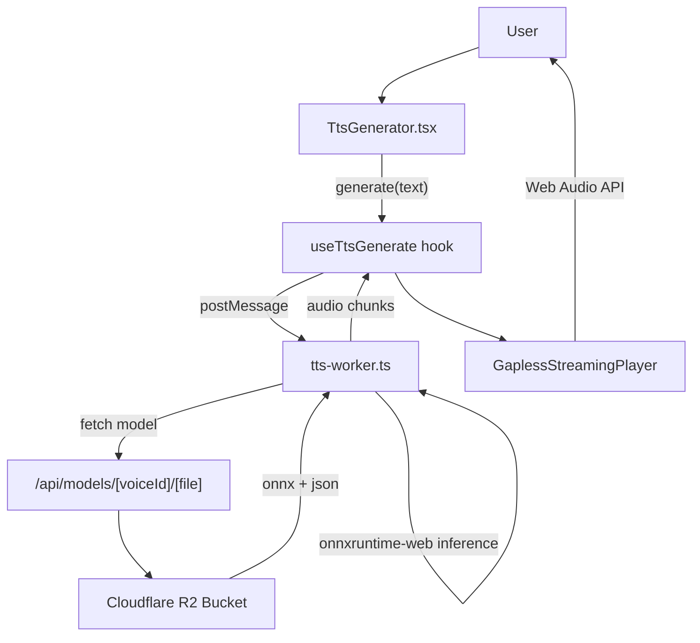

# GenVoice AI - Tài Liệu Học Tập Toàn Diện

> **Mục tiêu**: Giúp developer hiểu toàn bộ dự án từ kiến trúc, luồng xử lý, đến chi tiết implementation.
>
> **Cập nhật**: 2026-03-26

---

## Mục Lục

1. [Tổng Quan Dự Án](#1-tổng-quan-dự-án)
2. [Kiến Trúc Hệ Thống](#2-kiến-trúc-hệ-thống)
3. [Luồng Xử Lý TTS (Core Flow)](#3-luồng-xử-lý-tts-core-flow)
4. [Cấu Trúc Thư Mục & Quy Ước](#4-cấu-trúc-thư-mục--quy-ước)
5. [TTS Engine - Piper ONNX](#5-tts-engine---piper-onnx)
6. [Web Worker & Streaming Audio](#6-web-worker--streaming-audio)
7. [Gapless Streaming Player](#7-gapless-streaming-player)
8. [Cloudflare R2 & Model Caching](#8-cloudflare-r2--model-caching)
9. [Xử Lý Ngôn Ngữ Tiếng Việt](#9-xử-lý-ngôn-ngữ-tiếng-việt)
10. [State Management - Zustand Store](#10-state-management---zustand-store)
11. [Authentication & Licensing (Genation SDK)](#11-authentication--licensing-genation-sdk)
12. [Storage - IndexedDB](#12-storage---indexeddb)
13. [UI Components & Routing](#13-ui-components--routing)
14. [Audio Processing Utilities](#14-audio-processing-utilities)
15. [API Routes](#15-api-routes)
16. [Deployment - Cloudflare Pages](#16-deployment---cloudflare-pages)
17. [Testing](#17-testing)
18. [Quy Trình Phát Triển (SDD)](#18-quy-trình-phát-triển-sdd)
19. [Các Tính Năng Chính & SPECs](#19-các-tính-năng-chính--specs)

---

## 1. Tổng Quan Dự Án

### 1.1 Giới Thiệu

**GenVoice AI** là ứng dụng **Text-to-Speech (TTS)** chạy hoàn toàn trên trình duyệt (client-side), hỗ trợ tiếng Việt. Toàn bộ xử lý TTS diễn ra trong browser, không cần server inference.

```
┌─────────────────────────────────────────────────┐
│                 Browser (User)                   │
│  ┌─────────────┐    ┌──────────────────────────┐  │
│  │  Next.js UI │ →  │  ONNX Runtime Web (WASM)│  │
│  └─────────────┘    │  Piper TTS Model         │  │
│                     └──────────────────────────┘  │
└─────────────────────────────────────────────────┘
         ↑                          ↑
    Cloudflare R2              Cloudflare Pages
    (Voice Models)             (Static Files)
```

### 1.2 Tech Stack

| Layer | Công nghệ | Vai trò |
|---|---|---|
| **Framework** | Next.js 15 (App Router) | UI, Routing, API Routes |
| **UI** | React 19 + Tailwind CSS + shadcn/ui | Giao diện |
| **State** | Zustand + React Context | Quản lý state |
| **TTS Engine** | Piper TTS (ONNX) | Text → Audio inference |
| **Runtime** | ONNX Runtime Web (WASM) | Chạy model trong browser |
| **Model Storage** | Cloudflare R2 | Lưu trữ voice models |
| **Cache** | IndexedDB | Cache models + history audio |
| **Auth** | Genation SDK | Đăng nhập, licensing |
| **Deployment** | Cloudflare Pages + Pages Functions | Hosting |
| **Testing** | Vitest + Testing Library + Playwright | Unit & E2E tests |

### 1.3 Package.json Dependencies

```
Dependencies:
├── @genation/sdk ^0.2.12          # Auth & licensing
├── @mintplex-labs/piper-tts-web ^1.0.0  # Built-in Piper voices
├── clsx ^2.1.1                    # Class name utility
├── lucide-react ^0.577.0          # Icons
├── next ^15.1.0                   # Framework
├── react ^19.0.0                  # UI
├── tailwindcss ^3.4.17             # Styling
└── zustand ^5.0.0                 # State management

DevDependencies:
├── @cloudflare/next-on-pages ^1.13.16  # Cloudflare deployment
├── @playwright/test ^1.58.2        # E2E testing
├── vitest ^2.1.0                   # Unit testing
├── @testing-library/react ^16.0.0  # Component testing
└── wrangler ^4.73.0                # Cloudflare Workers
```

---

## 2. Kiến Trúc Hệ Thống

### 2.1 High-Level Architecture

```
┌─────────────────────────────────────────────────────────┐
│                      Browser                               │
│                                                          │
│  ┌──────────────┐    ┌──────────────┐    ┌────────────┐  │
│  │  Next.js App │ ←  │ Zustand Store│ ←  │ TtsProvider│ │
│  │  (UI Layer)  │    │  (State)     │    │ (Context)  │  │
│  └──────────────┘    └──────────────┘    └────────────┘  │
│         ↑                                    ↑            │
│         │                           ┌─────────────────┐    │
│         │                           │   Web Worker     │    │
│         └──────────────────────────→│  (tts-worker)    │    │
│                                     │                  │    │
│                                     │ ONNX Runtime WASM│    │
│                                     │ Piper ONNX Model │    │
│                                     └─────────────────┘    │
└─────────────────────────────────────────────────────────┘
         │                                     ↑
    Cloudflare Pages                         Cloudflare R2
    (API Routes, Static)                    (Voice Models)
```

### 2.2 Data Flow Mermaid



### 2.3 Key Architectural Decisions

| Quyết định | Lý do |
|---|---|
| **Client-side TTS** | Privacy - text không gửi lên server |
| **Web Worker** | TTS inference không block UI thread |
| **IndexedDB cache** | Model reuse không cần re-download |
| **Gapless streaming** | Phát audio liên tục, không khoảng trống |
| **R2 + API proxy** | Tránh CORS, cache 1 năm |
| **File config (r2-config.json)** | Không phụ thuộc build-time env |

---

## 3. Luồng Xử Lý TTS (Core Flow)

### 3.1 Tổng Quan

```
User nhập text
    ↓
Text normalization (tiếng Việt)
    ↓
Chunking (nếu text dài ≥ 1000 ký tự → streaming)
    ↓
Load/Use cached model từ IndexedDB
    ↓
ONNX inference: text → audio samples
    ↓
Encode WAV (16-bit PCM, 24kHz mono)
    ↓
Streaming: phát từng chunk ngay khi ready
    ↓
Lưu vào IndexedDB history
```

### 3.2 Text Normalization Pipeline

```
Input: "Ngày 26/03/2026, giá là 150.000 đồng"

Step 1: normalizeUnicode()        → NFC form
Step 2: removeSpecialChars()      → "&" → "và"
Step 3: normalizePunctuation()     → Chuẩn hóa "", ''
Step 4: removeThousandSeparators() → "150.000" → "150000"
Step 5: convertCurrency()          → "150000 đồng" → "một trăm năm mươi nghìn đồng"
Step 6: convertDate()             → "26/03/2026" → "ngày hai mươi sáu tháng ba năm hai nghìn hai mươi sáu"
Step 7: cleanWhitespace()         → trim spaces

Output: "Ngày hai mươi sáu tháng ba năm hai nghìn hai mươi sáu, giá là một trăm năm mươi nghìn đồng"
```

### 3.3 Streaming vs Non-Streaming Mode

| Điều kiện | Mode | Chi tiết |
|---|---|---|
| `text.length < 1000` | **Non-streaming** | Generate toàn bộ → phát một lần |
| `text.length ≥ 1000` | **Streaming** | Chunk → mỗi chunk phát ngay khi ready |

```
Streaming threshold = minChunksForStreaming(2) × charsPerChunk(500) = 1000 chars

Text dài 2000 ký tự → chia 4 chunks → mỗi chunk phát khi ready
```

### 3.4 Voice Model Loading

```
1. Check IndexedDB cache (isModelCached)
2. Fetch versions.json → so sánh version
3. Nếu cache outdated hoặc miss → download từ R2:
   - GET /api/models/{voiceId}/{voiceId}.onnx
   - GET /api/models/{voiceId}/{voiceId}.onnx.json
4. Save to IndexedDB với version
5. Load ONNX session via onnxruntime-web
6. Ready cho inference
```

---

## 4. Cấu Trúc Thư Mục & Quy Ước

### 4.1 Vertical Slice Architecture

Dự án tuân theo **Vertical Slice pattern** - code được nhóm theo feature, không phải theo loại.

```
src/
├── app/                              # Next.js App Router
│   ├── (main)/
│   │   ├── page.tsx                  # Trang chính (Dashboard)
│   │   └── layout.tsx               # Layout của (main) route group
│   ├── api/
│   │   ├── auth/signin/route.ts    # Auth API
│   │   └── models/[voiceId]/[file]/route.ts  # R2 model proxy
│   ├── auth/callback/page.tsx       # OAuth callback
│   ├── pricing/page.tsx             # Pricing page
│   ├── layout.tsx                   # Root layout
│   └── globals.css                  # Global styles + Tailwind
│
├── components/                       # Shared UI components
│   ├── ui/                          # shadcn/ui style components
│   │   ├── Toast.tsx
│   │   ├── ConfirmDialog.tsx
│   │   ├── EmptyState.tsx
│   │   ├── Skeleton.tsx
│   │   └── index.ts
│   ├── layout/                      # Layout components
│   │   ├── Header.tsx
│   │   ├── Sidebar.tsx
│   │   └── index.ts
│   ├── tts/                         # TTS feature components (shared)
│   │   ├── AudioPlayer.tsx
│   │   ├── VoiceLibrary.tsx
│   │   ├── MainContent.tsx
│   │   ├── VoiceCard.tsx
│   │   ├── VoiceCardShared.tsx
│   │   └── index.ts
│   ├── AuthProvider.tsx             # Genation SDK auth context
│   ├── LoginButton.tsx
│   ├── R2ConfigProvider.tsx         # Load r2-config.json
│   ├── ShareButton.tsx
│   ├── ThemeProvider.tsx
│   └── ThemeToggle.tsx
│
├── features/                         # Vertical slices (domain-driven)
│   └── tts/                         # TTS feature
│       ├── components/              # Feature-specific components
│       │   ├── TtsGenerator.tsx    # Main form input
│       │   ├── VoiceSettings.tsx    # Settings panel
│       │   ├── HistoryPanel.tsx    # History list
│       │   ├── DemoSamples.tsx      # Sample text buttons
│       │   ├── index.ts
│       │   └── TtsGenerator.test.tsx
│       ├── hooks/
│       │   └── useTtsGenerate.ts   # Core TTS generation hook
│       ├── context/
│       │   └── TtsContext.tsx      # TtsProvider context
│       ├── types.ts                # TypeScript types
│       └── store.ts                # Zustand store
│
├── lib/                             # Utilities & domain logic
│   ├── piper/                      # Piper TTS wrapper
│   │   ├── piperTts.ts            # Built-in voices loader
│   │   ├── piperR2.ts             # R2 + IndexedDB model cache
│   │   └── piperCustom.ts         # Custom ONNX model loader
│   ├── audio/                      # Audio processing
│   │   ├── wav.ts                 # WAV encode/decode
│   │   ├── gaplessStreamingPlayer.ts  # Web Audio gapless playback
│   │   └── pitchShift.ts          # Pitch shifting
│   ├── text-processing/            # Vietnamese text processing
│   │   ├── vietnameseNormalizer.ts  # Full normalization pipeline
│   │   ├── vietnameseNormalizer.test.ts
│   │   ├── textProcessor.ts       # Validation utilities
│   │   └── textProcessor.test.ts
│   ├── storage/                    # IndexedDB storage
│   │   ├── history.ts             # Audio history (v6)
│   │   ├── history.test.ts
│   │   ├── modelCache.ts         # Model cache
│   │   ├── blobUrl.ts            # Blob URL management
│   │   ├── blobUrl.test.ts
│   │   └── notifications.ts       # Notification store (Zustand)
│   ├── hooks/                     # Shared hooks
│   │   ├── index.ts
│   │   ├── useAuth.ts            # Auth state
│   │   ├── useLicense.ts         # License/plan management
│   │   ├── useLicense.test.ts
│   │   ├── useAudioPlayer.ts    # Web Audio API hook
│   │   ├── useTheme.ts           # Theme management
│   │   ├── useLocale.ts          # i18n hook
│   │   ├── useNotification.ts
│   │   └── useLicense.ts
│   ├── genation/                  # Genation SDK wrapper
│   │   ├── client.ts             # Genation client singleton
│   │   ├── config.ts             # Genation config
│   │   └── index.ts
│   ├── config/                    # App configuration
│   │   ├── voiceData.ts          # Voice metadata (UI)
│   │   └── r2Config.ts           # R2 URL config
│   ├── cloudflare-env.ts          # Cloudflare env helpers
│   ├── logger.ts                  # Production logger
│   └── utils.ts                   # cn() helper, utilities
│
├── workers/                        # Web Workers
│   └── tts-worker.ts              # TTS inference worker
│
├── __tests__/
│   └── setup.ts                   # Vitest setup
│
└── config.ts                      # Root config (voice IDs, URLs, etc.)

public/
├── r2-config.json                 # R2 public URL config
├── tts-model/vi/versions.json     # Model versions for cache invalidation
└── logo_3D.png                   # Favicon
```

### 4.2 File Naming Conventions

| Loại | Pattern | Ví dụ |
|---|---|---|
| Component | `{name}.tsx` | `TtsGenerator.tsx` |
| Hook | `use{name}.ts` | `useTtsGenerate.ts` |
| Service | `{name}.ts` | `piperTts.ts` |
| Types | `types.ts` | `features/tts/types.ts` |
| Utils | `{name}.ts` | `wav.ts` |
| Worker | `{name}.worker.ts` | `tts-worker.ts` |
| Test | `{name}.test.ts` hoặc `{name}.test.tsx` | `wav.test.ts` |

### 4.3 Import Order

```typescript
// 1. React/Next imports
import { useCallback, useState } from "react";
import Link from "next/link";

// 2. External libraries
import { clsx } from "clsx";

// 3. Internal shared
import { Button } from "@/components/ui/button";
import { cn } from "@/lib/utils";

// 4. Feature imports (absolute path alias)
import { useTtsGenerate } from "@/features/tts/hooks/useTtsGenerate";
import type { TtsRequest } from "@/features/tts/types";

// 5. Relative (within same feature)
import { formatDuration } from "../utils/format";
```

### 4.4 Path Aliases (tsconfig.json)

```json
{
  "compilerOptions": {
    "paths": {
      "@/*": ["./src/*"],
      "@features/*": ["./src/features/*"]
    }
  }
}
```

---

## 5. TTS Engine - Piper ONNX

### 5.1 Hai Loại Voice Models

Dự án hỗ trợ **2 loại voice models**:

| Loại | Nguồn | Prefix | Ví dụ |
|---|---|---|---|
| **Built-in** | `@mintplex-labs/piper-tts-web` | Không prefix | `vi_VN-vais1000-medium` |
| **Custom** | Cloudflare R2 / public folder | `custom:` | `custom:ngochuyen` |

**Hiện tại**: Dự án dùng **custom-only mode** - tất cả voices đều là custom models từ R2.

### 5.2 Model Config Structure

Mỗi voice model gồm 2 files trong R2 bucket:

```
vi/{voiceId}/
├── {voiceId}.onnx           # ONNX model weights (~50MB)
└── {voiceId}.onnx.json     # Model config
```

**Config JSON structure:**

```json
{
  "phoneme_type": "espeak",        // "text" | "espeak"
  "espeak": { "voice": "vi" },   // espeak voice (cho phoneme_type=espeak)
  "phoneme_id_map": {
    "^": 0, "$": 1, "_": 2,        // BOS, EOS, PAD tokens
    "a": 3, "ă": 4, "â": 5,       // Vietnamese phonemes...
  },
  "num_speakers": 1,
  "speaker_id_map": { "0": 0 },
  "audio": { "sample_rate": 24000 },
  "inference": {
    "noise_scale": 0.667,
    "length_scale": 1.0,
    "noise_w": 0.8
  }
}
```

### 5.3 ONNX Inference Pipeline

```
Input text
    ↓
1. Phonemization
   ├── phoneme_type = "text"  → NFD normalize + lowercase + phoneme_id_map
   └── phoneme_type = "espeak" → Piper WASM phonemizer (espeak-ng) + fallback
    ↓
2. Tokenize → phoneme_ids (int64 array)
    ↓
3. ONNX Session.run() với inputs:
   - input: [1, seq_len] int64 — phoneme IDs
   - input_lengths: [1] int64 — sequence length
   - scales: [3] float32 — [noise_scale, length_scale, noise_w]
   - sid: [1] int64 (optional) — speaker ID
    ↓
4. Output: [1, audio_samples] float32
```

### 5.4 Chunking Strategy (Long Text)

Để tránh memory issues với text dài, model xử lý text thành chunks (max 500 ký tự):

```typescript
// Split by sentence boundaries
const sentences = text.match(/[^.!?]+[.!?]+|[^.!?]+$/g) || [text];

// Merge sentences until chunk reaches maxChunkSize
// If single sentence exceeds limit → split by words
```

### 5.5 Piper Phonemizer WASM

Với `phoneme_type = "espeak"`, app dùng Piper WASM phonemizer:

```typescript
// Load từ CDN để tránh relative path issues trong worker
const phonemizeUrl = "https://cdn.jsdelivr.net/npm/@mintplex-labs/piper-tts-web@1.0.4/dist/piper-o91UDS6e.js";

// Timeout 60 giây cho text dài
const wasmModule = await createPiperPhonemize({
  print(data) { /* nhận phoneme_ids JSON */ },
  locateFile(url) {
    if (url.endsWith(".wasm")) return "https://cdn.jsdelivr.net/npm/@diffusionstudio/piper-wasm@1.0.0/build/piper_phonemize.wasm";
    if (url.endsWith(".data")) return "...data";
    return url;
  }
});
```

---

## 6. Web Worker & Streaming Audio

### 6.1 Worker Architecture

`tts-worker.ts` chạy trong **Web Worker** (không block main thread):

```typescript
// Worker message types (main → worker)
type TtsWorkerMessage =
  | { type: "generate"; payload: TtsRequest }
  | { type: "loadModel"; payload: { voice: string } }
  | { type: "terminate" }
  | { type: "setR2PublicUrl"; payload: string };

// Worker message types (worker → main)
type TtsWorkerOutgoingMessage =
  | { type: "workerReady" }
  | { type: "progress"; progress: number }
  | { type: "chunk"; audio: ArrayBuffer; index: number; isStreaming: boolean }
  | { type: "complete"; audio: ArrayBuffer; duration: number; wasStreaming?: boolean }
  | { type: "error"; error: string };
```

### 6.2 Worker Initialization Flow

```
1. Worker loads → posts "workerReady"
2. Main thread nhận workerReady → load r2-config.json
3. Main thread → postMessage({ type: "setR2PublicUrl", payload: url })
4. Main thread → postMessage({ type: "loadModel", payload: { voice: defaultVoice } })
   → Preload default voice model
5. Worker sẵn sàng cho generate
```

### 6.3 WASM Path Resolution

Worker cần biết đường dẫn ONNX WASM files:

```typescript
// Prefer same-origin /onnx/ để tránh MIME type issues
const ONNX_WASM_BASE =
  typeof location !== "undefined"
    ? `${location.origin}/onnx/`
    : "https://cdn.jsdelivr.net/npm/onnxruntime-web@1.24.3/dist/";

const PIPER_WASM_BASE =
  "https://cdn.jsdelivr.net/npm/@diffusionstudio/piper-wasm@1.0.0/build/piper_phonemize";
```

### 6.4 Session Caching

Worker giữ session objects để reuse:

```typescript
let ttsSession: TtsSession | null = null;      // Built-in voices
let customSession: PiperCustomSession | null = null;  // Custom voices
let customSessionVoiceId: string | null = null;
```

### 6.5 Pitch Shift Post-Processing

Sau khi generate audio, pitch có thể được điều chỉnh:

```typescript
// Semitones: -12 to +12 (0 = no change)
// +12 = one octave up (shorter, higher)
// -12 = one octave down (longer, lower)

if (pitch !== 0) {
  const clampedPitch = Math.max(-12, Math.min(12, pitch));
  audioFloat32 = pitchShift(audioFloat32, clampedPitch);
}
```

---

## 7. Gapless Streaming Player

### 7.1 Tại Sao Cần Gapless?

Khi text dài và chia thành nhiều chunks, nếu phát từng chunk riêng biệt sẽ có **khoảng trống (gap)** giữa các chunks. `GaplessStreamingPlayer` dùng **Web Audio API** để lên lịch chunk tiếp theo bắt đầu **ngay khi** chunk trước kết thúc.

### 7.2 Class API

```typescript
class GaplessStreamingPlayer {
  constructor(callbacks: {
    onProgress: (currentTime: number, duration: number) => void;
    onStreamEnded: () => void;
  });

  scheduleChunk(wavArrayBuffer: ArrayBuffer): Promise<void>;
  // Decode WAV → schedule AudioBufferSourceNode bắt đầu đúng thời điểm

  markComplete(): void;
  // Gọi khi worker gửi "complete" - không còn chunk nào

  pause(): void;
  // Tạm dừng (không hủy scheduled chunks)

  resume(): void;
  // Tiếp tục từ vị trí đã pause

  stop(): void;
  // Dừng hoàn toàn, release resources

  setVolume(value: number): void;
  setPlaybackRate(value: number): void;
  isPaused(): boolean;
  isStopped(): boolean;
  getCurrentTime(): number;
}
```

### 7.3 Scheduling Logic

```typescript
async scheduleChunk(wavArrayBuffer: ArrayBuffer) {
  const ctx = this.getContext();
  const buffer = await ctx.decodeAudioData(wavArrayBuffer.slice(0));

  const source = ctx.createBufferSource();
  source.buffer = buffer;
  source.playbackRate.value = this.playbackRate;
  source.connect(this.gainNode);

  // Lên lịch: chunk này bắt đầu ngay khi chunk trước kết thúc
  source.start(this.nextStartTime);
  this.nextStartTime += buffer.duration;
  this.totalScheduledDuration += buffer.duration;
}
```

### 7.4 Progress Tracking

Dùng `requestAnimationFrame` loop để track progress:

```typescript
private tick = () => {
  if (this.stopped || !this.context) return;

  const currentTime = Math.max(0,
    Math.min(
      this.context.currentTime - this.firstStartTime,
      this.totalScheduledDuration
    )
  );

  this.callbacks.onProgress(currentTime, this.totalScheduledDuration);

  // Kiểm tra nếu đã complete và hết scheduled audio
  if (this.receivedComplete && ctx.currentTime >= this.nextStartTime - 0.05) {
    this.callbacks.onStreamEnded();
    return;
  }

  this.rafId = requestAnimationFrame(this.tick);
};
```

---

## 8. Cloudflare R2 & Model Caching

### 8.1 R2 Bucket Structure

```
genvoice-models/ (R2 Bucket Name)
├── vi/                        # Vietnamese voices
│   ├── ngochuyen/
│   │   ├── ngochuyen.onnx
│   │   ├── ngochuyen.onnx.json
│   │   └── sample.wav         # Pre-rendered preview (5-10s)
│   ├── banmai/
│   │   ├── banmai.onnx
│   │   ├── banmai.onnx.json
│   │   └── sample.wav
│   ├── manhdung/
│   │   ├── manhdung.onnx
│   │   ├── manhdung.onnx.json
│   │   └── sample.wav
│   └── ... (12 voices total)
└── tts-model/
    └── vi/
        └── versions.json     # Cache invalidation manifest
```

### 8.2 Voice ID Mapping

Một số voice IDs trong app khác với folder name trong R2:

```typescript
// src/config.ts
export const VOICE_ID_TO_R2_FOLDER: Record<string, string> = {
  mytam2: "mytam",        // App uses "mytam2", R2 folder là "mytam"
  namminh: "naminh_giong_tram",
};

export const VOICE_ID_TO_MODEL_FILE: Record<string, string> = {
  namminh: "namminh_tram", // App uses "namminh", model file là "namminh_tram.onnx"
  baouyen: "baouyen_6388",
};

export function getR2FolderForVoice(voiceId: string): string {
  return VOICE_ID_TO_R2_FOLDER[voiceId] ?? voiceId;
}

export function getModelFileName(voiceId: string): string {
  return VOICE_ID_TO_MODEL_FILE[voiceId] ?? voiceId;
}
```

### 8.3 IndexedDB Model Cache

```
Database: "tts-model-cache" (v1)
├── Store: "models"
│   └── { voiceId: string }
│       ├── voiceId: string
│       ├── version: string       # Từ versions.json
│       ├── model: ArrayBuffer   # ONNX file
│       ├── config: object       # PiperVoiceConfig JSON
│       ├── downloadedAt: number
│       └── size: number
```

### 8.4 Cache Loading Flow

```typescript
async function loadPiperWithCache(options: LoadModelOptions) {
  const { voiceId, baseUrl, onProgress } = options;

  // 1. Check if already cached
  const cached = await loadModelFromCache(voiceId);
  const cloudVersions = await fetchVersions();

  if (cached && !isNewerVersion(cloudVersions[voiceId], cached.version)) {
    // Cache hit, valid version → return from IndexedDB
    return { session, fromCache: true };
  }

  // 2. Cache miss or outdated → download from R2
  const modelUrl = `${baseUrl}/${r2Folder}/${modelFileName}.onnx`;
  const configUrl = `${baseUrl}/${r2Folder}/${modelFileName}.onnx.json`;

  const [modelRes, configRes] = await Promise.all([
    fetch(modelUrl),
    fetch(configUrl),
  ]);

  const modelBuffer = await modelRes.arrayBuffer();
  const voiceConfig = JSON.parse(await configRes.text());

  // 3. Save to IndexedDB
  await saveModelToCache(voiceId, modelBuffer, voiceConfig, version);

  // 4. Load ONNX session
  return { session, fromCache: false };
}
```

### 8.5 Version Checking

```typescript
// versions.json format:
{
  "ngochuyen": "1.0.0",
  "banmai": "1.0.0",
  "mytam2": "1.0.1"  // Updated version!
}

// If cloud version > local version → re-download
function isNewerVersion(cloudVersion: string, localVersion: string): boolean {
  const cloud = (cloudVersion ?? "0.0.0").split(".").map(Number);
  const local = (localVersion ?? "0.0.0").split(".").map(Number);
  // Compare semantically
}
```

### 8.6 R2 Configuration Strategy

App dùng **file cấu hình tĩnh** thay vì build-time env vars:

```
Why NOT NEXT_PUBLIC_R2_PUBLIC_URL?
→ Cloudflare Pages build environment có thể không có quyền truy cập env vars
→ File tĩnh r2-config.json deploy cùng app, không phụ thuộc build

Flow:
1. R2ConfigProvider.tsx → fetch /r2-config.json on app load
2. getR2PublicUrl() → return URL để components/worker dùng
3. Worker nhận URL via setR2PublicUrl message (sau workerReady)
```

```typescript
// public/r2-config.json
{ "r2PublicUrl": "https://pub-xxx.r2.dev" }
```

---

## 9. Xử Lý Ngôn Ngữ Tiếng Việt

### 9.1 Vietnamese Normalizer Pipeline

`vietnameseNormalizer.ts` xử lý text qua **16 bước** theo thứ tự:

```typescript
export function normalizeVietnamese(text: string): string {
  text = normalizeUnicode(text);              // 1. NFC form
  text = removeSpecialChars(text);            // 2. & → "và", @ → "a còng", # → "thăng"
  text = normalizePunctuation(text);           // 3. Chuẩn hóa "", '', –, —
  text = removeThousandSeparators(text);       // 4. "150.000" → "150000"
  text = convertRangesWithUnitsAndCurrency(text); // 5. 10-20m → "10 đến 20 mét"
  text = convertYearRange(text);              // 6. "2020-2025" → words
  text = convertDate(text);                   // 7. "26/03/2026" → "ngày hai mươi sáu..."
  text = convertTime(text);                   // 8. "14:30" → "mười bốn giờ ba mươi phút"
  text = convertRomanNumerals(text);          // 9. "III" → "3" (1-30 only)
  text = convertOrdinal(text);                // 10. "tập 5" → "tập năm"
  text = convertCurrency(text);               // 11. "150.000đ" → "một trăm năm mươi nghìn đồng"
  text = convertPercentage(text);              // 12. "50%" → "năm mươi phần trăm"
  text = convertPhoneNumber(text);            // 13. "0901234567" → "không chín..."
  text = convertDecimal(text);                // 14. "3.5" → "ba phẩy năm"
  text = convertMeasurementUnits(text);        // 15. "5km" → "năm ki-lô-mét"
  text = convertStandaloneNumbers(text);       // 16. "123" → "một trăm hai mươi ba"
  text = cleanWhitespace(text);               // Trim & collapse spaces
  return text;
}
```

### 9.2 Vietnamese Number Conversion

```typescript
numberToWords(150000)
// → "một trăm năm mươi nghìn"

numberToWords(23)
// → "hai mươi ba"

numberToWords(15)
// → "mười lăm"

// Special cases:
// 1 → "một" (không "mốt" sau chục)
// 4 → "bốn" (không "tư" sau chục, trừ 24)
// 5 → "lăm" (sau chục, không "năm")
```

### 9.3 Date Conversion

```typescript
convertDate("26/03/2026")
// → "ngày hai mươi sáu tháng ba năm hai nghìn không trăm hai mươi sáu"

convertDate("ngày 01-12-2025")
// → "ngày một đến mười hai tháng không trăm..."

convertDate("tháng 03/2026")
// → "tháng ba năm hai nghìn không trăm hai mươi sáu"
```

### 9.4 Currency Conversion

```typescript
convertCurrency("Giá 150.000 đồng")
// → "Giá một trăm năm mươi nghìn đồng"

convertCurrency("$99.99 USD")
// → "chín mươi chín phẩy chín chín đô la"

convertCurrency("Tài khoản: 1.234.567đ")
// → "Tài khoản: một triệu hai trăm ba mươi tư nghìn năm trăm sáu mươi bảy đồng"
```

---

## 10. State Management - Zustand Store

### 10.1 Store Structure

`features/tts/store.ts` chứa toàn bộ TTS state:

```typescript
interface TtsState {
  // Settings
  settings: TtsSettings;              // model, voice, speed, volume, pitch, normalizeText
  inputText: string;                   // Persisted in sessionStorage

  // Generation status
  status: TtsStatus;                  // idle|loading|generating|previewing|playing|error|streaming-ended
  playbackStatus: PlaybackStatus;     // idle|playing|paused|buffering
  progress: number;                    // 0-100

  // Audio
  currentAudio: Blob | null;
  currentAudioUrl: string | null;
  nowPlaying: TtsHistoryItem | null;
  previewItem: TtsHistoryItem | null;

  // Streaming
  streamingState: StreamingState;     // idle|buffering|playing
  streamingCurrentTime: number;
  streamingDuration: number;
  pausedStreaming: boolean;

  // History
  history: TtsHistoryItem[];
  isHistoryLoaded: boolean;
  lastSavedHistoryId: string | null;
  currentUserId: string | null;       // For user isolation

  // Storage
  storageInfo: StorageInfo;

  // Error
  error: string | null;
}
```

### 10.2 SessionStorage Persistence

Input text được persist vào **sessionStorage** (không phải localStorage) để:

- Sống sót qua tab navigation
- Xóa khi browser đóng

```typescript
function createSessionStorage() {
  return {
    getItem: (name) => sessionStorage.getItem(name),
    setItem: (name, value) => sessionStorage.setItem(name, value),
    removeItem: (name) => sessionStorage.removeItem(name),
  };
}

export const useTtsStore = create<TtsState>()(
  persist(
    (set, get) => ({ ... }),
    {
      name: "tts-settings",
      storage: createJSONStorage(() => createSessionStorage()),
      partialize: (state) => ({
        settings: state.settings,
        inputText: state.inputText,
      }),
    }
  )
);
```

### 10.3 Blob URL Memory Management

**Quan trọng**: Blob URLs được revoke đúng lúc để tránh memory leak.

```typescript
// Chỉ revoke nếu URL không còn được history giữ
function isBlobUrlRetainedByHistory(
  url: string | null,
  history: TtsHistoryItem[]
): boolean {
  if (!url) return false;
  return history.some((h) => h.audioUrl === url);
}

// Trong setCurrentAudio:
if (oldUrl && oldUrl !== url && !isBlobUrlRetainedByHistory(oldUrl, history)) {
  revokeBlobUrl(oldUrl);
}
```

### 10.4 User Isolation

History được isolate theo user:

```typescript
// Khi login/logout:
setCurrentUserId(userId);
loadHistory(); // Load history của user đó

// Lưu history với userId:
await saveHistoryItem(item, audioBlob, userId || "anonymous");

// Load history với userId:
const dbItems = await getHistory(limit, userId || undefined);
```

---

## 11. Authentication & Licensing (Genation SDK)

### 11.1 Genation SDK Integration

Genation SDK cung cấp **đăng nhập OAuth + licensing**:

```typescript
// src/lib/genation/client.ts
export function getGenationClient(): GenationClient | null {
  if (typeof window === "undefined") return null;

  genationClient = createClient({
    clientId: config.clientId,
    clientSecret: config.clientSecret,
    redirectUri: config.redirectUri,
  });

  return genationClient;
}

// Available functions:
export async function getSession(): Promise<Session | null>;
export async function getLicenses(): Promise<License[]>;
export async function hasActivePlan(planCode: string): Promise<boolean>;
export async function isAuthenticated(): Promise<boolean>;
export async function signIn(): Promise<string>;    // Returns OAuth URL
export async function signOut(): Promise<void>;
export function onAuthStateChange(callback): { unsubscribe };
```

### 11.2 Plan Structure

| Plan | Code | Access |
|---|---|---|
| **Miễn phí** | `FREE` | 2 voices: `manhdung` + `ngochuyen` |
| **Pro** | `PRO` | Tất cả 12 voices |

```typescript
// Plan check helpers
export const PLAN_ACCESS = {
  FREE: {
    code: "FREE",
    features: { maxVoiceModels: 2, allowedVoiceIds: ["manhdung", "ngochuyen"] }
  },
  PRO: {
    code: "PRO",
    features: { maxVoiceModels: -1 }  // unlimited
  }
};

export function canUseVoiceForPlan({ planCode, voiceId }): boolean {
  if (isProPlanCode(planCode)) return true;
  return FREE_ALLOWED_VOICE_IDS.includes(voiceId);
}
```

### 11.3 Auth Flow

```
1. User clicks "Đăng nhập"
   → signIn() → redirect to Genation OAuth
   ↓
2. User authorizes
   → redirect to /auth/callback?code=xxx
   ↓
3. /auth/callback/page.tsx
   → handleCallback(url)
   → getSession() → set user state
   ↓
4. useAuth hook subscribes to auth state changes
   → useLicense hook fetches licenses
   → UI updates to show Pro features (if applicable)
```

### 11.4 Post-Purchase Flow

Sau khi mua plan trên Genation Store:

```
1. User redirected back: /auth/callback?signed_in=true
2. useLicense hook detects ?signed_in=true
3. refreshLicenses() được gọi
4. URL được clean: router.replace("/", { scroll: false })
5. UI cập nhật: Pro features unlocked
```

---

## 12. Storage - IndexedDB

### 12.1 Two IndexedDB Databases

```
┌────────────────────────────────────────────────────┐
│ Database 1: "tts-model-cache" (v1)                  │
│ ├── Store: "models"                                  │
│ │   └── voiceId (key) → CachedModel { model, config, version } │
└────────────────────────────────────────────────────┘

┌────────────────────────────────────────────────────┐
│ Database 2: "tts-audio-db" (v6)                    │
│ ├── Store: "audio-history"                          │
│ │   ├── Index: "createdAt" → sort by time         │
│ │   └── Index: "userId" → filter by user           │
│ │       └── id (key) → StoredHistoryRecord { audio Blob, metadata, userId } │
└────────────────────────────────────────────────────┘
```

### 12.2 History Storage Schema

```typescript
interface StoredHistoryRecord {
  id: string;
  text: string;
  model: string;
  voice: string;
  speed: number;
  duration: number;
  createdAt: number;
  userId?: string;       // Optional for legacy records
  audio: Blob;            // WAV audio blob (NOT blob URL)
}
```

### 12.3 History Loading

```typescript
export async function getHistory(
  limit?: number,
  userId?: string
): Promise<TtsHistoryItem[]> {
  // Mở cursor từ newest → oldest (index: createdAt, direction: prev)
  // Filter by userId nếu provided
  // Tạo fresh blob URL từ stored Blob
  // Return với audioUrl được tạo mới (URL.createObjectURL)
}
```

### 12.4 Storage Migration

```typescript
// Khi có userId mới được thêm (v5 → v6 upgrade):
async function onupgradeneeded(event) {
  const upgradeTx = event.transaction;

  if (!database.objectStoreNames.contains("audio-history")) {
    // Fresh install: create store
  } else {
    // Upgrade: add userId index
    const objectStore = upgradeTx.objectStore("audio-history");
    if (!objectStore.indexNames.contains("userId")) {
      objectStore.createIndex("userId", "userId", { unique: false });
    }
  }
}
```

### 12.5 Legacy localStorage Migration

```typescript
async function migrateLocalStorageHistory(): Promise<TtsHistoryItem[]> {
  const alreadyMigrated = localStorage.getItem("tts-history-migrated");
  if (alreadyMigrated) return [];

  // Legacy data không có audio blob → không migrate được
  // Chỉ clear legacy data, new generations sẽ lưu vào IDB
  localStorage.removeItem("tts-history");
  localStorage.setItem("tts-history-migrated", "true");
  return [];
}
```

---

## 13. UI Components & Routing

### 13.1 Route Structure

```
app/
├── (main)/          # Route group: có sidebar + header
│   ├── layout.tsx   # Sidebar + Header layout
│   └── page.tsx    # / → Dashboard
├── api/             # API routes (Edge runtime)
├── auth/
│   └── callback/
│       └── page.tsx    # OAuth callback handler
└── pricing/
    └── page.tsx       # Pricing page
```

### 13.2 Main Page Layout

`app/(main)/page.tsx` quản lý **tab-based navigation**:

```
Sidebar tabs:
├── dashboard      → MainContent (TTS form)
├── voice_library  → VoiceLibrary (voice grid)
├── history        → HistoryPanel (history list)
└── settings       → VoiceSettings (settings form)
```

### 13.3 TtsProvider Context

```typescript
// TtsContext wraps entire app để worker không bị unmount khi navigate
export function TtsProvider({ children }) {
  const value = useTtsGenerate();  // Creates worker, manages TTS
  return <TtsContext.Provider value={value}>{children}</TtsContext.Provider>;
}

export function useTts(): TtsContextValue {
  // Consumer hook
}
```

### 13.4 AudioPlayer Component

Fixed footer player hiển thị khi có `currentAudioUrl`:

- Play/Pause/Skip controls
- Progress bar (clickable seek)
- Volume control
- Download button
- Gapless progress tracking via `streamingCurrentTime`

### 13.5 VoiceCard Component

Mỗi voice trong VoiceLibrary:

```
┌─────────────────────────────┐
│ 🎤 Ngọc Huyền               │
│ Miền Bắc | Nữ | Truyền cảm│
│                             │
│ [▶ Preview]  [Chọn giọng]  │
│                             │
│ Giọng đọc nhẹ nhàng...     │
└─────────────────────────────┘
```

Preview ưu tiên `sample.wav` từ R2 (instant), fallback sang TTS generate.

---

## 14. Audio Processing Utilities

### 14.1 WAV Encoding (`wav.ts`)

```typescript
// Encode: Float32Array → WAV ArrayBuffer (16-bit PCM, mono)
function encodeWav(
  float32Array: Float32Array,
  sampleRate: number  // e.g. 24000
): ArrayBuffer {
  // WAV header: RIFF + fmt + data chunks
  // Audio data: 16-bit PCM, normalized from [-1, 1] to [-32768, 32767]
  // Return: ArrayBuffer ready for Blob
}

// Decode: WAV ArrayBuffer → Float32Array + sampleRate
function decodeWav(wavBuffer: ArrayBuffer): WavDecodeResult {
  // Parse RIFF header
  // Read fmt chunk (channels, sampleRate)
  // Read data chunk
  // Convert 16-bit PCM → Float32 [-1, 1]
  // If stereo: average channels to mono
}

// Concatenate: Float32Array[] → Float32Array
function concatFloat32Arrays(arrays: Float32Array[]): Float32Array {
  // Allocate single buffer, copy each array sequentially
}
```

### 14.2 Pitch Shift (`pitchShift.ts`)

Dùng **cubic interpolation resampling** để thay đổi pitch:

```typescript
function pitchShift(audio: Float32Array, semitones: number): Float32Array {
  // semitones = -12 to +12
  // +12 = one octave up = ratio = 2^(-12/12) = 0.5 → compress (fewer samples)
  // -12 = one octave down = ratio = 2^(-(-12)/12) = 2 → expand (more samples)

  const ratio = 2 ** (-semitones / 12);
  const newLength = Math.floor(audio.length * ratio);

  // Cubic interpolation for smoother quality
  for (let i = 0; i < newLength; i++) {
    const srcIndex = i / ratio;
    out[i] = cubicInterpolate(s0, s1, s2, s3, t);
  }

  return out;
}
```

---

## 15. API Routes

### 15.1 Model Proxy Route

`app/api/models/[voiceId]/[file]/route.ts` (Edge Runtime):

```
GET /api/models/ngochuyen/ngochuyen.onnx
GET /api/models/ngochuyen/ngochuyen.onnx.json
GET /api/models/ngochuyen/sample.wav
```

**Flow:**

```
1. Validate voiceId (whitelist)
2. Validate filename (prevent path traversal: .., /, \)
3. Get R2 public URL from env hoặc Cloudflare binding
4. Prefer: direct R2 URL fetch (tránh Pages 500 errors)
5. Fallback: R2 binding get()
6. Return với COEP headers + 1-year cache
```

**Security validations:**

```typescript
// Voice ID whitelist
const ALLOWED_VOICE_IDS = ["anhkhoi", "banmai", ...];

// Filename validation (prevent traversal)
if (file.includes("..") || file.includes("/") || file.includes("\\")) {
  return 400;
}

// Allowed files per voice
const allowedFiles = [
  `${voiceId}.onnx`, `${voiceId}.onnx.json`,
  "sample.wav", "model.onnx", "model.onnx.json",
  `${modelFileName}.onnx`, `${modelFileName}.onnx.json`
];
```

### 15.2 COEP Headers

```typescript
// Required cho ONNX WASM cross-origin operations
const COEP_HEADERS = {
  "Cross-Origin-Opener-Policy": "same-origin",
  "Cross-Origin-Embedder-Policy": "require-corp",
};
```

---

## 16. Deployment - Cloudflare Pages

### 16.1 wrangler.toml

```toml
name = "genvoice-ai"
compatibility_date = "2024-01-01"
pages_build_output_dir = ".next"

[[r2_buckets]]
binding = "VIETVOICE_MODELS"
bucket_name = "genvoice-models"
```

### 16.2 Environment Variables

| Variable | Required | Purpose |
|---|---|---|
| `R2_PUBLIC_URL` | Local dev | Direct R2 URL cho API route |
| `NEXT_PUBLIC_R2_PUBLIC_URL` | Optional | Expose to client |
| `GENATION_CLIENT_ID` | Production | Genation OAuth |
| `GENATION_CLIENT_SECRET` | Production | Genation OAuth |
| `GENATION_STORE_URL` | Optional | Upgrade flow |

### 16.3 Deployment Checklist

```
1. npm run build                    # Build Next.js
2. npx wrangler pages deploy .next  # Deploy to Cloudflare Pages
3. Upload models to R2:
   npx wrangler r2 object put vi/ngochuyen/ngochuyen.onnx \
     --bucket genvoice-models \
     --file ./models/ngochuyen.onnx
4. Upload versions.json
5. Configure Cloudflare Pages env vars
6. Custom domain (optional)
```

---

## 17. Testing

### 17.1 Test Commands

```bash
npm run test              # Run all tests (Vitest)
npm run test -- filename  # Run specific file
npm run test:e2e          # Playwright E2E
npm run test:e2e:ui       # Playwright UI mode
```

### 17.2 Test Files

| File | Coverage |
|---|---|
| `src/lib/text-processing/vietnameseNormalizer.test.ts` | Number, date, currency, time conversion |
| `src/lib/text-processing/textProcessor.test.ts` | Text validation |
| `src/lib/storage/history.test.ts` | IndexedDB CRUD |
| `src/lib/storage/blobUrl.test.ts` | Blob URL management |
| `src/lib/hooks/useLicense.test.ts` | License state |
| `src/features/tts/store.test.ts` | Zustand store |
| `src/features/tts/streaming.test.ts` | Streaming state |
| `src/features/tts/store.blobUrl.test.ts` | Store + blob URL |
| `src/features/tts/components/TtsGenerator.test.tsx` | Component rendering |
| `src/lib/logger.test.ts` | Logger |

### 17.3 Test Setup (Vitest)

```typescript
// src/__tests__/setup.ts
import "@testing-library/jest-dom";
// Setup global mocks, test utilities
```

---

## 18. Quy Trình Phát Triển (SDD)

### 18.1 Spec-Driven Development Workflow

```
┌─────────────────────────────────────────────────────┐
│ Phase 1: Discovery (AI làm một mình)                │
│  - Hiểu feature request                             │
│  - Explore codebase                                 │
│  - Đọc context docs                               │
│  - Tạo SPEC.md draft                                │
└─────────────────────┬───────────────────────────────┘
                      ↓
┌─────────────────────────────────────────────────────┐
│ Phase 2: Mob Elaboration (với Human)                │
│  - Trình bày hiểu biết ban đầu                     │
│  - Hỏi clarifying questions                       │
│  - Thảo luận approach                              │
│  - Human approves → chuyển Phase 3                   │
└─────────────────────┬───────────────────────────────┘
                      ↓
┌─────────────────────────────────────────────────────┐
│ Phase 3: Refinement (AI làm một mình)               │
│  - Update SPEC.md với decisions                      │
│  - Tạo ADRs nếu cần                                │
│  - Prepare implementation plan                      │
└─────────────────────┬───────────────────────────────┘
                      ↓
┌─────────────────────────────────────────────────────┐
│ Phase 4: Mob Construction (Implementation)          │
│  - Human approves SPEC.md                            │
│  - AI implement theo spec                           │
│  - Write tests                                      │
│  - Human reviews & approves                          │
└─────────────────────────────────────────────────────┘
```

### 18.2 Definition of Done

Mỗi task phải hoàn thành **TẤT CẢ**:

- [ ] Code chạy không lỗi
- [ ] Build pass (`npm run build`)
- [ ] Không lint errors (`npm run lint`)
- [ ] Code formatted (`npm run format`)
- [ ] Tests viết cho features mới
- [ ] JSDoc documentation complete
- [ ] Human reviewed & approved

---

## 19. Các Tính Năng Chính & SPECs

### 19.1 Feature SPEC Matrix

| SPEC ID | Feature | Status | Description |
|---|---|---|---|
| REQ-001 | Piper TTS Engine | ✅ | ONNX inference, built-in voices |
| REQ-002 | TTS Generation | ✅ | Generate audio from text |
| REQ-003 | Playback Controls | ✅ | Play, pause, seek, volume |
| REQ-004 | Generation History | ✅ | List past generations |
| REQ-005 | Voice Caching | ✅ | IndexedDB model cache |
| REQ-006 | Settings Persistence | ✅ | localStorage settings |
| REQ-007 | Multi-language | ✅ | Vietnamese + English voices |
| REQ-008 | Vietnamese Text | ✅ | Vietnamese normalizer |
| REQ-009 | Dark Mode | ✅ | Theme toggle |
| REQ-010 | IndexedDB History | ✅ | Audio blob storage |
| REQ-011 | Share Button | ✅ | URL share với text/voice/speed |
| REQ-012 | Cloudflare R2 | ✅ | Lazy model loading |
| REQ-013 | Plan & License (Genation) | ✅ | FREE/PRO plans |
| REQ-014 | Streaming Audio Playback | ✅ | Gapless streaming |
| REQ-015 | User Isolation | ✅ | Per-user history |

### 19.2 Voice Library (12 Voices)

| Voice ID | Tên | Region | Gender | Style |
|---|---|---|---|---|
| `ngochuyen` | Ngọc Huyền | Miền Bắc | Nữ | Truyền cảm |
| `ngocngan` | Ngọc Ngạn | Miền Bắc | Nữ | Tin tức |
| `banmai` | Ban Mai | Miền Bắc | Nữ | Tin tức |
| `baouyen` | Bảo Uyên | Miền Bắc | Nữ | Truyền cảm |
| `manhdung` | Mạnh Dũng | Miền Nam | Nam | Doanh nghiệp |
| `minhquang` | Minh Quang | Miền Trung | Nam | Truyền cảm |
| `maiphuong` | Mai Phương | Miền Bắc | Nữ | Quảng cáo |
| `lacphi` | Lạc Phi | Miền Trung | Nữ | Du lịch |
| `minhkhang` | Minh Khang | Miền Bắc | Nam | Giáo dục |
| `chieuthanh` | Chiếu Thành | Miền Nam | Nam | Truyền thống |
| `mytam2` | Mỹ Tâm | Miền Nam | Nữ | Ca hát |
| `anhkhoi` | Anh Khôi | Miền Bắc | Nam | Hiện đại |

### 19.3 Key Configuration (`src/config.ts`)

```typescript
export const config = {
  tts: {
    maxTextLength: 5000,
    defaultModel: "custom:ngochuyen",
    defaultVoice: "custom:ngochuyen",
    defaultSpeed: 1.0,
    defaultVolume: 1.0,
    historyLimit: 50,
    customModelBaseUrl: "/api/models",
  },
  streaming: {
    minChunksForStreaming: 2,
    charsPerChunk: 500,
    bufferChunks: 2,
  },
  freeAllowedVoiceIds: ["manhdung", "ngochuyen"],
  activeVoiceIds: [ /* 12 voice IDs */ ],
  customModels: [ /* metadata for all voices */ ],
};
```

---

## Quick Reference

### Common Tasks

**Thêm voice mới:**
1. Upload model files to R2: `vi/newhoice/newhoice.onnx` + `newhoice.onnx.json`
2. Add to `activeVoiceIds` in `src/config.ts`
3. Add metadata in `src/config/voiceData.ts`
4. Add to `ALLOWED_VOICE_IDS` in API route

**Sửa text normalization:**
1. Edit `src/lib/text-processing/vietnameseNormalizer.ts`
2. Thêm/update test trong `vietnameseNormalizer.test.ts`
3. Test với các edge cases

**Debug worker:**
1. Check browser DevTools → Console/Workers tab
2. Worker logs: `[worker] ...`
3. R2 config: fetch `/r2-config.json`

**Debug model loading:**
1. Kiểm tra R2 bucket structure
2. Check versions.json upload
3. Verify R2 public URL trong r2-config.json
4. Check Network tab cho /api/models/* requests

### Key Files

| Mục đích | File |
|---|---|
| TTS core | `src/workers/tts-worker.ts` |
| ONNX loader | `src/lib/piper/piperCustom.ts` |
| R2 cache | `src/lib/piper/piperR2.ts` |
| Vietnamese NLP | `src/lib/text-processing/vietnameseNormalizer.ts` |
| State | `src/features/tts/store.ts` |
| Generation hook | `src/features/tts/hooks/useTtsGenerate.ts` |
| Gapless player | `src/lib/audio/gaplessStreamingPlayer.ts` |
| API route | `src/app/api/models/[voiceId]/[file]/route.ts` |
| Auth | `src/lib/genation/client.ts` |
| Config | `src/config.ts` |

---

> **Ghi chú**: Tài liệu này phản ánh trạng thái code tại thời điểm 2026-03-26. Để cập nhật, đọc source code trực tiếp từ các file trong `src/`.
